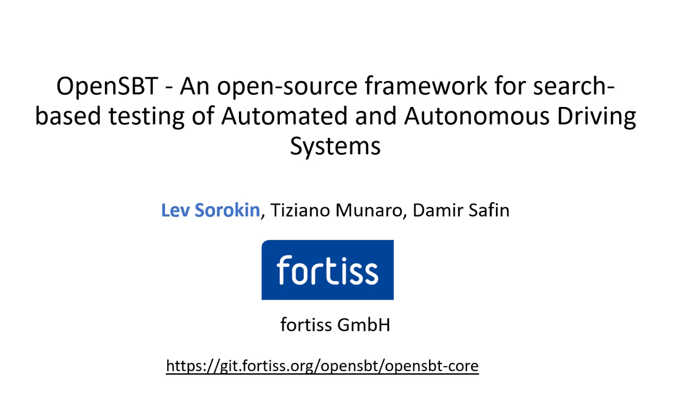

# OpenSBT - An open-source framework for the application of search-based testing approaches for Automated and Autonomous Driving Systems


## Intro


<div align="center">

[](https://download.fortiss.org/public/OpenSBT/OpenSBT_presentation_final_HD.mp4)

</div>

OpenSBT provides a modular and extandable code base for the application of search-based testing approaches on AD/ADAS systems.

## Preliminaries

The tool requires python to be installed.
To install all dependencies run:

```
python -m pip install -r requirements.txt
```

## Usage

We describe the usage of the framework by testing the BehaviourAgent (SUT) in the CARLA Simulator.

As testing scenario we consider a pedestrian that is crossing the lane of the ego vehicle. We vary the speed of ego, the speed of pedestrian, and the distance to the ego vehicle when the pedestrian starts walking to identify whether the SUT behaves faulty.

### 1. Integrating the Simulator/SUT

To integrate a simulator we need to implement the [simulate]() method of the [Simulator]() class. In this method a scenario instance is passed to the simulator to execute the SUT in the scenario.

The implementation of this method is simulator specific. For CARLA we have implemented an [interface module](https://git.fortiss.org/fortissimo/ff1_testing/ff1_carla), that needs to be called by the simulate method. This module needs to be installed first.

### 2. Implementing a fitness function

To implement a new fitness function we need to implement the Fitness class (interface). We implement the eval function in the class, which receives as input one simulation output and returns a scalar or vector-valued output.
In our example as the first objective we want to minimze the distance to the pedestrian, and maximize the velocity of ego:


```
class FitnessMinDistanceVelocity(Fitness):
    @property
    def min_or_max(self):
        return "min", "max"

    @property
    def name(self):
        return "Min distance", "Velocity at min distance"

    def eval(self, simout: SimulationOutput) -> Tuple[float]:
        if "adversary" in simout.location:
            name_adversary = "adversary"
        else:
            name_adversary = "other"

        traceEgo = simout.location["ego"]
        tracePed = simout.location[name_adversary]

        ind_min_dist = np.argmin(geometric.distPair(traceEgo, tracePed))

        # distance between ego and other object
        distance = np.min(geometric.distPair(traceEgo, tracePed))

        # speed of ego at time of the minimal distance
        speed = simout.speed["ego"][ind_min_dist]

        return (distance, speed)

```

Further we implement a [criticality function](evaluation/critical.py) by implementing the interface class *Critical* to indicate when a scenario is considered fault-revealing/critical. The corresponding eval function receives as input the fitness value(s) end declares based on this whether a scenario is critical: (here: when min distance < 0.5 m , ego velocity > 0 (inverted sign)). 


```python
class CriticalAdasFrontCollisions(Critical):
    def eval(self, vector_fitness, simout: SimulationOutput = None):
        if simout is not None:
            isCollision = simout.otherParams['isCollision']
        else:
            isCollision = None

        if (isCollision == True) or (vector_fitness[0] < 0.5) and (vector_fitness[1] < 0):
            return True
        else:
            return False

```
### 3. Integrating the search algorithm

The search technique is represented by the (abstract) *Optimizer* class.
We instantiate in the init function the SearchAlgorithm which has to be an instance of **Algorithm** pymoo. We instantiate NSGAII from pymoo as done [here](algorithm/nsga2_optimizer.py).

### 4. Defining the experiment
 
Consider: Step 2 and 3 is only required when using the console for experiment execution.

To define an experiment we do the following:

1. We instantiate *ADASProblem* to define the search space for the optimization and assign the simulator, fitness/criticality function.

```python
problem = ADASProblem(
                        problem_name="PedestrianCrossingStartWalk",
                        scenario_path=os.getcwd() + "/scenarios/PedestrianCrossing.xosc",
                        xl=[0.5, 1, 0],
                        xu=[3, 80, 60],
                        simulation_variables=[
                            "PedestrianSpeed",
                            "FinalHostSpeed",
                            "PedestrianEgoDistanceStartWalk"],
                        fitness_function=FitnessMinDistanceVelocityFrontOnly(),  
                        critical_function=CriticalAdasFrontCollisions(),
                        simulate_function=CarlaSimulator.simulate,
                        simulation_time=10,
                        sampling_time=100,
                        approx_eval_time=10,
                        do_visualize = False
                        )
                        
```
2. We create an experiment instance, assigning the name, the problem, the algorithm and the search configuration for the algorithm to be used. 

```python
experiment = Experiment(name="1",
                        problem=problem,
                        algorithm=AlgorithmType.NSGAII,
                        search_configuration=DefaultSearchConfiguration())
```

3. We register the experiment to use it via the console.
```python
experiments_store.register(getExp1())
```
### 5. Starting search

- To start search without console

```python
optimizer = NsgaIIOptimizer(
                            problem=problem,
                            config=DefaultSearchConfiguration()
                            )
res = optimizer.run()
res.write_results(results_folder=results_folder, params = optimizer.parameters)
```

- To start search via console

To run the experiment with the name "1" we execute:

```bash
python run.py -e 1
```

We can change search parameter as parameter boundaries, search time using flags:

```bash
python run.py -e 1 -a 1 -min 0 0 -max 10 2 -m "SpeedEgo" "SpeedPed" -t "01:00:00"
```

### Optional Parameters

All flags that can be set are (get options by -h flag):

```
 -h, --help            show this help message and exit
  -e EXP_NUMBER         Name of existing experiment to be used. (show all experiments via -info)].
  -i N_GENERATIONS      Number generations to perform.
  -n SIZE_POPULATION    The size of the initial population of scenario candidates.
  -a ALGORITHM          The algorithm to use for search. (Currently only 1: NSGAII supported.)
  -t MAXIMAL_EXECUTION_TIME
                        The time to use for search.
  -f SCENARIO_PATH      The path to the scenario description file.
  -min VAR_MIN [VAR_MIN ...]
                        The lower bound of each search parameter.
  -max VAR_MAX [VAR_MAX ...]
                        The upper bound of each search parameter.
  -m DESIGN_NAMES [DESIGN_NAMES ...]
                        The names of the variables to modify.
  -o RESULTS_FOLDER     The name of the folder where the results of the search are stored (default: \results\single\)
  -v                    Whether to use the simuator's visualization. This feature is useful for debugging and demonstrations, however it reduces the search performance.
  -info                 Names of all defined experiments.
```


### Results

When the search has terminated, results are written into the *results* folder in a folder named as the problem name.

OpenSBT creates the following plots:

- Design Space Plot


- Scenario 2D visualization


- Objective Space Plot


- HV Plot


Following csv. files are generated:

- all_testcases: Contains a list of all evaluated testcases
- calculation_properties: Algorihm parameters used for search (e.g. population size)
- optimal_testcases: List of the "worst/optimal" testcases
- summary_results: Details of the experiment setup

## Visual Studio Code Integration

To reproduce the example setup included with the OpenSBT framework in [Microsoft Visual Studio Code](https://code.visualstudio.com/) copy the following `launch.json` and `tasks.json` files in the `.vscode` directory of your workspace. Make sure to replace all `/path/to/` paths according to your setup.

### launch.json

```json
{
    "version": "0.2.0",
    "configurations": [
        {
            "name": "OpenSBT",
            "type": "python",
            "request": "launch",
            "program": "run.py",
            "console": "integratedTerminal",
            "justMyCode": true,
            "env": {
                "CARLA_ROOT": "/path/to/carla/repository",
                "PYTHONPATH": "/path/to/carla/repository/PythonAPI/carla/dist/carla-0.9.13-py3.7-linux-x86_64.egg:/path/to/carla/repository/PythonAPI/carla/agents:/path/to/carla/repository/PythonAPI/carla:/path/to/carla/scenario/runner/repository",
                "SCENARIO_RUNNER_ROOT": "/path/to/carla/scenario/runner/repository"
            },
            "args": [
                "-e", "1",
                "-n", "30",
                "-i", "50",
                "-t", "01:00:00",
                "-v"
            ],
            "preLaunchTask": "start",
            "postDebugTask": "stop"
        }
    ]
}
```

### tasks.json

```json
{
    "version": "2.0.0",
    "tasks": [
        {
            "label": "make_directory",
            "type": "shell",
            "command": "mkdir",
            "args": [
                "-p",
                "/tmp/recordings"
            ]
        },
        {
            "label": "carla_start",
            "type": "shell",
            "command": "docker",
            "args": [
                "compose",
                "-f", "/path/to/opensbt/carla/runner/docker-compose.yml",
                "up",
                "-d",
                "--scale", "carla-server=2"
            ]
        },
        {
            "label": "carla_stop",
            "type": "shell",
            "command": "docker",
            "args": [
                "compose",
                "-f", "/path/to/opensbt/carla/runner/docker-compose.yml",
                "down"
            ]
        },
        {
            "label": "start",
            "dependsOn": [
                "make_directory",
                "carla_start"
            ]
        },
        {
            "label": "stop",
            "dependsOn": [
                "carla_stop"
            ]
        }
    ]
}

```
## Features to be implemented

- [ ] GUI
- [ ] Improve the architecture to define algorithms


## License

OpenSBT is licensed under the [Apache License, Version 2.0](LICENSE).

## Authors

Lev Sorokin (sorokin@fortiss.org) \
Tiziano Munaro (munaro@fortiss.org) \
Damir Safin (safin@fortiss.org)
