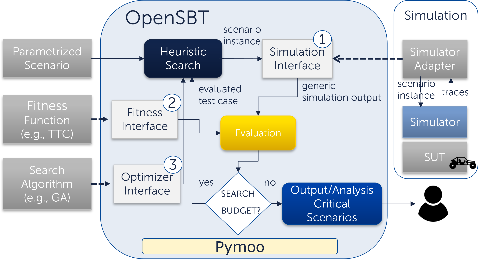
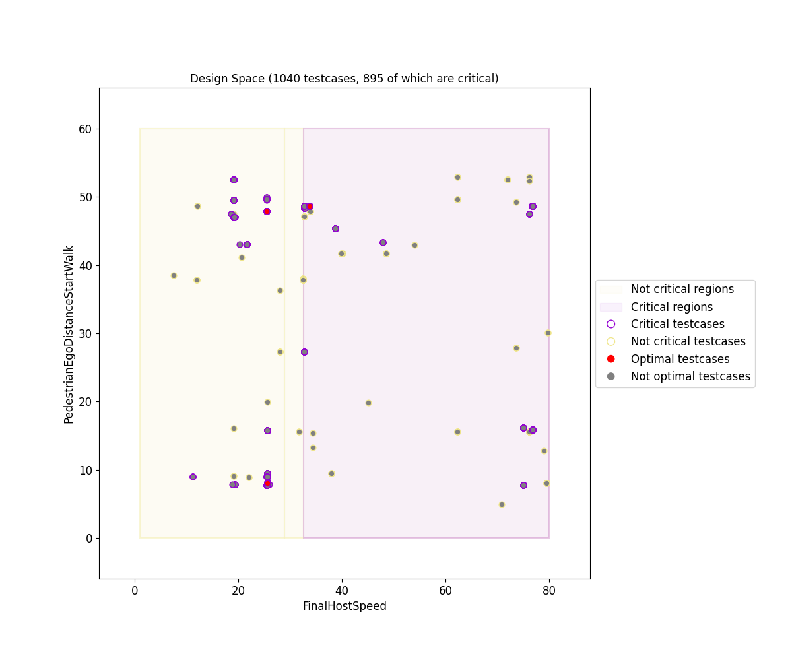
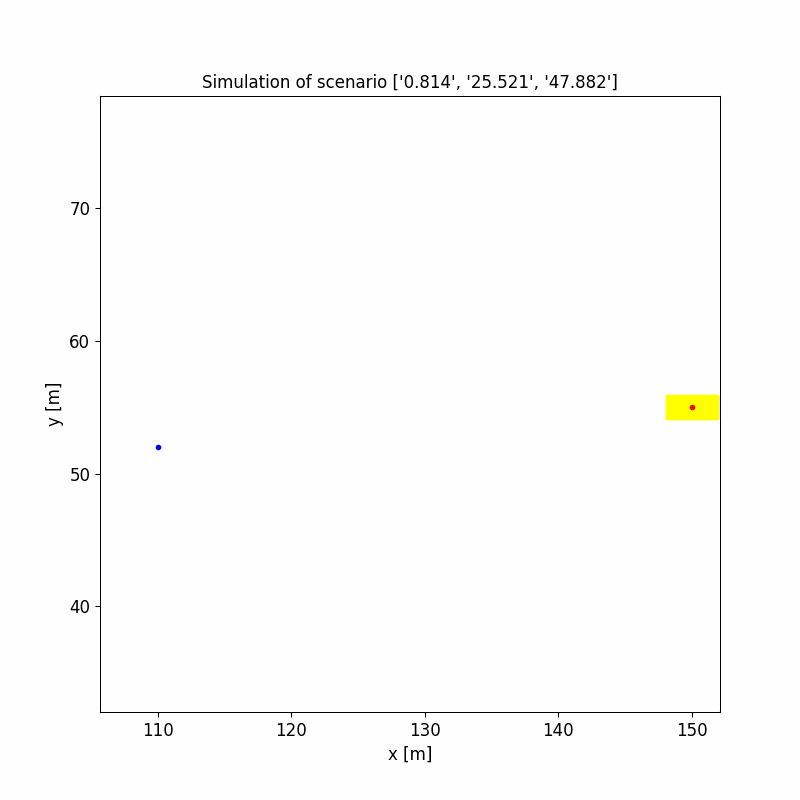

# OpenSBT - A Modular Framework for Search-based Testing of Automated Driving Systems

## Intro

OpenSBT provides a modular and extandable code base for the search-based testing of automated driving systems. It provides interfaces to integrate search algorithms, fitness/criticality functions and simulation environments in a modular way. It allows to visualize testing results and analyse the critical behaviour of the tested system. 

A demo video of OpenSBT can be found here: https://www.youtube.com/watch?v=oOyug8rwAB8.

## Architecture

OpenSBT builds upon [Pymoo](https://pymoo.org/) 0.6.0 and extends internal optimization related models, to tailor heuristic search algorithms for testing ADS systems.

## Installation

OpenSBT requires python to be installed and its compatibality has been tested with python 3.7 and 3.8. OpenSBT can be run as a standalone application or can be imported as a library.  To import it as a library you need to install the correspnding pip package [PIP-package](TODO). Further installation instructions are available [here](/doc/jupyter/01_Installation.ipynb).

The main difference is that using the standalone mode allows us to modify and execute existing testing experiments by using command line flags.

## Usage

After having installed OpenSBT, you can follow the tutorials provided as [jupyter notebooks](/doc/jupyter) which explain step-by-step of how to use OpenSBT. In these tutorials, we have integrated:

-  A simplified SUT simulated in very simplistic simulator (linear motion planning, no GPU required) 
-  A real-world FMI-based AEB agent simulated in [CARLA](https://carla.org/) using the simulator adapter [CARLA Runner Extension](https://git.fortiss.org/opensbt/carla-runner). (link to fortiss lab)

_Note: We have also implemented a [simulator adapter](https://git.fortiss.org/opensbt/prescan_runner) for the execution of Prescan experiments._

## Output

OpenSBT produces several result artefacts. All artefacts are written into the *results* folder in a folder named as the problem name. 
OpenSBT generates the following outputs:

| Type | Description | Example | 
|:--------------|:-------------|:--------------|
| Design Space Plot | Visualization of all evaluated test cases in the input space + of predited critical regions using the decision tree algorithm, pairwise. Constraints of derived regions are stored in CSV file [bounds_regions.csv](doc/example/results/single/PedestrianCrossingStartWalk/NSGA2/ex2/classification/bounds_regions.csv) and the learned tree in [tree.pdf](example/results/single/PedestrianCrossingStartWalk/NSGA2/ex2/classification/tree.pdf) |   |
| Scenario 2D Visualization | Visualization of traces of the ego vehicle and adversaries in a two-dimensional GIF animation |  |
Objective Space Plot | Visualization of fitness values of evaluated test cases, pairwise.   |  |
| All Testcases |  CSV file of all test inputs of all evaluated testcases | [all_testcases.csv](doc/example/results/single/PedestrianCrossingStartWalk/NSGA2/ex2/all_testcases.csv) |
| All Critical Testcases |  CSV file of all critical test inputs of all evaluated testcases | [critical_testcases.csv](doc/example/results/single/PedestrianCrossingStartWalk/NSGA2/ex2/critical_testcases.csv)|
| Calculation Properties |  CSV file of all experiment configuration parameters (e.g. algorithm parameters, such as population size, number iterations; search space, fitness function etc..).  | [calculation_properties.csv](doc/example/results/single/PedestrianCrossingStartWalk/NSGA2/ex2/calculation_properties.csv) |
| Evaluation Results |  CSV file containing performance values of the algorithm, e.g., number critical test cases found in relation to all evaluations, execution time.| [summary_results.csv](doc/example/results/single/PedestrianCrossingStartWalk/NSGA2/ex2/summary_results.csv)|

## License

OpenSBT is licensed under the [Apache License, Version 2.0](LICENSE).

## Authors

Lev Sorokin (sorokin@fortiss.org) \
Tiziano Munaro (munaro@fortiss.org) \
Damir Safin (safin@fortiss.org) 

