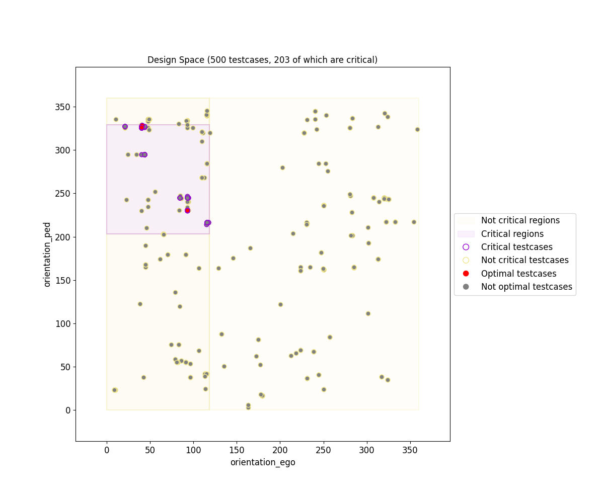
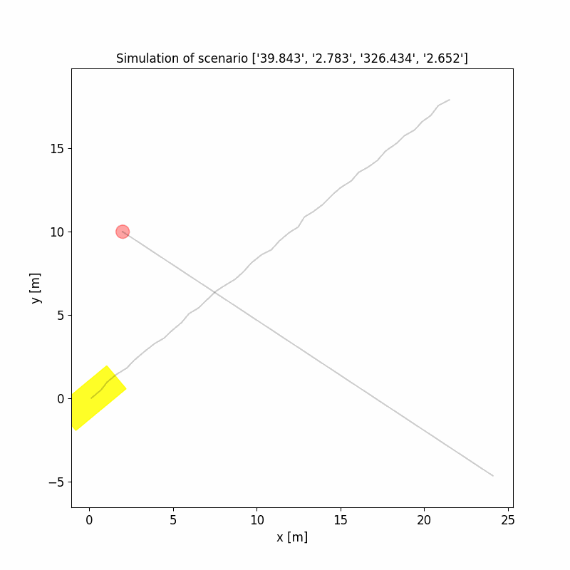

# OpenSBT - A Modular Framework for Search-based Testing of Automated Driving Systems

## Intro

OpenSBT provides a modular and extandable code base to facilitate search-based testing of automated driving systems. It provides interfaces to integrate search algorithms, fitness/criticality functions and simulation environments in a modular way. It allows to visualize testing results and analyse the critical behaviour of the tested system. 

An introductory video of OpenSBT can be found here: https://youtu.be/6csl_UAOD_4?si=JOUtN2gOo8hTRTLf.

## Overview

OpenSBT builds upon [Pymoo](https://pymoo.org/) 0.6.0 and extends internal optimization related models, such as `Problem`, `Result`, to tailor heuristic search algorithms for testing ADS systems.

## Installation

OpenSBT requires python to be installed and its compatibality has been tested with python 3.8. OpenSBT can be run as a standalone application or can be imported as a library.

Installation instructions are available in the following [jupyter notebook](/doc/jupyter/01_Installation.ipynb).

## Usage

You can find several tutorials as [jupyter notebooks](/doc/jupyter) which explain step-by-step of how to use OpenSBT. In these tutorials, we have integrated:

-  A simplified SUT simulated in very simplistic simulator (linear motion planning, no GPU required) 
-  A real-world FMI-based AEB agent developed in the [fortiss Mobility lab](https://www.fortiss.org/forschung/fortiss-labs/detail/mobility-lab) which is simulated in [CARLA](https://carla.org/) using the simulator adapter [CARLA Runner Extension](https://git.fortiss.org/opensbt/carla-runner).

_Note: We have also implemented a [simulator adapter](https://git.fortiss.org/opensbt/prescan_runner) for testing Simulink-based SUTs in Prescan._

## Output

OpenSBT produces several result artefacts. All artefacts are written into the *results* folder in a folder named as the problem name. 
OpenSBT generates the following outputs:

| Type | Description | Example | 
|:--------------|:-------------|:--------------|
| Design Space Plot | Visualization of all evaluated test cases in the input space + of predicted critical regions using the decision tree algorithm, pairwise. Constraints of derived regions are stored in CSV file [bounds_regions.csv](doc/example/results/single/PedestrianCrossingStartWalk/NSGA2-F/ex1/classification/bounds_regions.csv) and the learned tree in [tree.pdf](doc/example/results/single/PedestrianCrossingStartWalk/NSGA2-F/ex1/classification/tree.pdf) |   |
| Scenario 2D Visualization | Visualization of traces of the ego vehicle and adversaries in a two-dimensional GIF animation |  |
Objective Space Plot | Visualization of fitness values of evaluated test cases, pairwise.   |  |
| All Testcases |  CSV file of all test inputs of all evaluated testcases | [all_testcases.csv](doc/example/results/single/PedestrianCrossingStartWalk/NSGA2-F/ex1/all_testcases.csv) |
| All Critical Testcases |  CSV file of all critical test inputs of all evaluated testcases | [critical_testcases.csv](doc/example/results/single/PedestrianCrossingStartWalk/NSGA2-F/ex1/critical_testcases.csv)|
| Calculation Properties |  CSV file of all experiment configuration parameters (e.g. algorithm parameters, such as population size, number iterations; search space, fitness function etc..).  | [calculation_properties.csv](doc/example/results/single/PedestrianCrossingStartWalk/NSGA2-F/ex1/calculation_properties.csv) |
| Evaluation Results |  CSV file containing performance values of the algorithm, e.g., number critical test cases found in relation to all evaluations, execution time.| [summary_results.csv](doc/example/results/single/PedestrianCrossingStartWalk/NSGA2-F/ex1/summary_results.csv)|

## Contribution

If you like to contribute please contact one of the developers listed below.

## Acknowledgements

OpenSBT has been developed by Lev Sorokin (sorokin@fortiss.org), Tiziano Munaro (munaro@fortiss.org) and Damir Safin (safin@fortiss.org) within the 
[FOCETA Project](https://www.foceta-project.eu/tools/). 

Special thanks go to Brian Hsuan-Cheng Liao (h.liao@eu.denso.com) and Adam Molin (a.molin@eu.denso.com) from [DENSO AUTOMOTIVE Deutschland GmbH](https://www.denso.com/de/de/about-us/company-information/dnde/) for their valuable feedback and evaluation of OpenSBT on the AVP Case Study in the Prescan simulator.

## License

OpenSBT is licensed under the [Apache License, Version 2.0](LICENSE).
