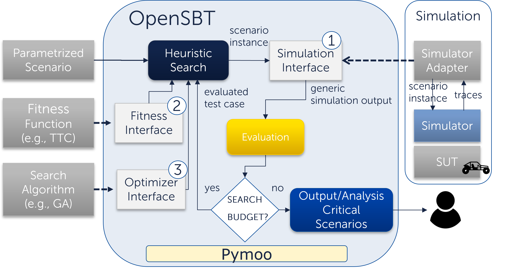
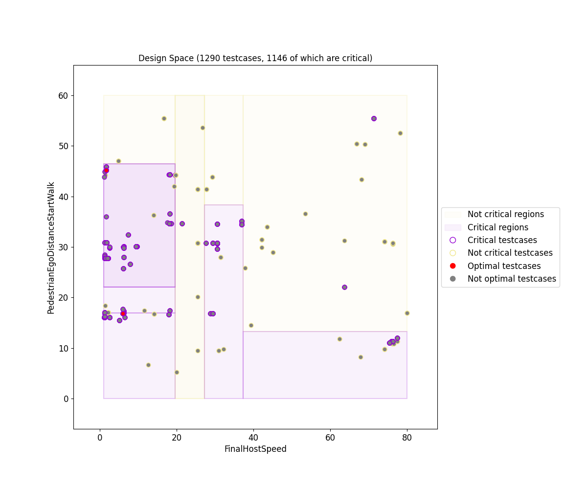
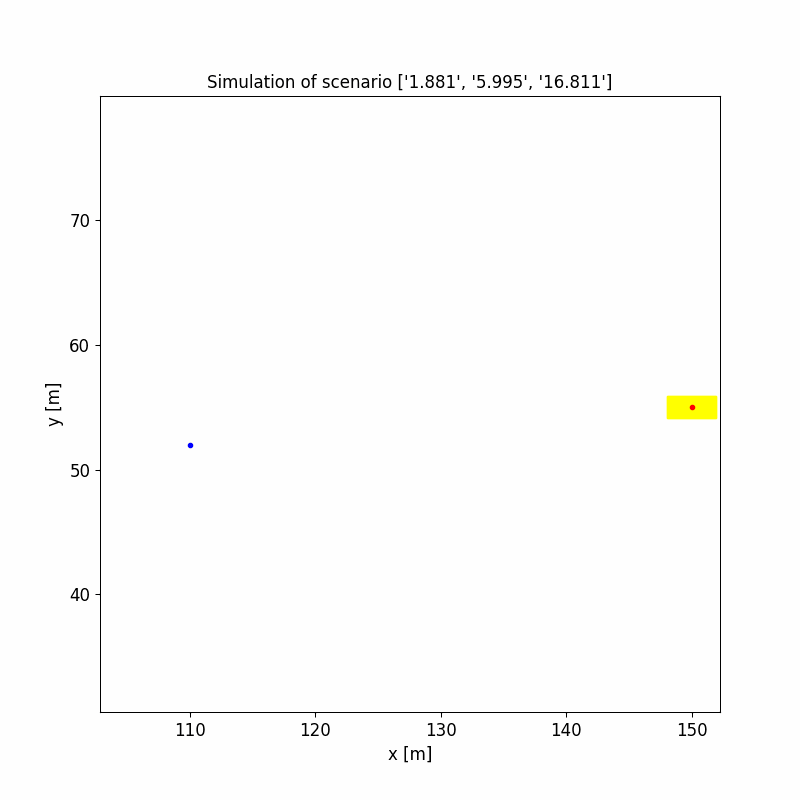

# OpenSBT - A Modular Framework for Search-based Testing of Automated Driving Systems


## Intro

OpenSBT provides a modular and extandable code base for the search based testing of automated driving systems. It provides interfaces to integrate search algorithms, fitness/criticality functions and simulation environments in a modular way. That means, one of this components can be replaced by a another component without the need to change the connectivity to other components or adapt the result analysis/visualization. Further it visualizes the test outcome and analysis the critical behaviour of the ADS. 

A video with a demo of OpenSBT can be found here: https://www.youtube.com/watch?v=oOyug8rwAB8.


## Architecture

[]()
OpenSBT builds upon [Pymoo](Pymoo). It extends internal models as Individual, Result to apply SBT of ADS.
Further it provides three interfaces/abstractions to integrate 
SBT component in a modular way.

## Installation

The tool requires python to be installed. Compatibility has been tested with python 3.7/3.8. It is recommented to create a virtual environment and install all dependencies by executing:

```bash
bash install.sh
```

## Usage

OpenSBT provides three interface\abstract classes for the integration of SBT components:

- Simulator integration:
    1. Implement [simulate]() method of the [`Simulator`]() class. In this method a list scenario instances is passed to the simulator to execute the SUT in the scenario. 
    2. Convert the simulation output returned by the simulator to generic `Simulator` instance.

    As an example, OpenSBT already provides extensions for CARLA and Prescan Simulator.

- Fitness\Criticality function integration:

    Fitness\Criticality Function: implement  `eval` method of the `Fitness` (`Critical`) class.

    *Consider*: Several fitness ojectives are specified in one fitness instance, i.e. the eval method return a vector valued output if more than objective is optimized.

- Algorithm integration:
    Integration is done by subclassing `Optimizer` class.
    There are three options for the integration:
    
    -  If the algorithm exists in `pymoo`, instantiate it in `run` and assign to `algorithm` 
    
    - If the algorithm does not exist in pymoo, override `run` and implement the algorithm. The return type should be a `SimulationResult`.

    - Implement new algorithm by sublassing `Algorithm` from pymoo and use first approach for integration.

 - Search space and experiment definition:

    The path to the scenario, the input variables and its bounds are passed to `ADASProblem`. The `simulate` function together with the fitness and criticality function is also passed. Consider following exemplary problem definition:

        problem = ADASProblem(
                            problem_name="PedestrianCrossingStartWalk",
                            scenario_path=os.getcwd() + "/scenarios/PedestrianCrossing.xosc",
                            xl=[0.5, 1, 0],
                            xu=[3, 80, 60],
                            simulation_variables=[
                                "PedSpeed",
                                "EgoSpeed",
                                "PedDistance"],
                            fitness_function=FitnessMinDistanceVelocity(),  
                            critical_function=CriticalAdasDistanceVelocity(),
                            simulate_function=CarlaSimulator.simulate,
                            )
    
 - Experiment execution:


    - To start directly in code

        ```python
        optimizer = MyOptimizer(problem=problem,
                            config=DefaultSearchConfiguration())
        res = optimizer.run()
        res.write_results(results_folder=results_folder, params = optimizer.parameters)
        ```

    - To start search via console
        
        1. Create new `Experiment`

            ```python
            experiment = Experiment(name="MyNewExperiment",
                                    problem=problem,
                                    algorithm=AlgorithmType.NSGAII, # Registered in AlgorithmType, updated in run.py
                                    search_configuration=DefaultSearchConfiguration() # Search configuration
                                    )
            ```
        2. To run the experiment with the name "1" we execute:

            ```bash
            python run.py -e "MyNewExperiment"
            ```

### Usage Example
We describe the usage of the framework by testing the BehaviourAgent (AEB) in the CARLA Simulator for collisions and close to collision situations. The example has been implemented on Ubuntu.

As testing scenario we consider a pedestrian that is crossing the lane of the ego vehicle. The scenario is provided as an OpenSCENARIO 1.2 [file](scenarios/PedestrianCrossing.xosc). We vary the speed of ego, the speed of pedestrian, and the distance to the ego vehicle when the pedestrian starts walking.


### 1. Integrating the Simulator/SUT

To integrate a simulator we need to implement the [simulate]() method of the [`Simulator`]() class. In this method a scenario instance is passed to the simulator to execute the SUT in the scenario.

The implementation of *simulate* is simulator specific. For CARLA we have implemented a [module](https://git.fortiss.org/fortissimo/ff1_testing/ff1_carla), that needs to be called from the simulate method. 

### 2. Implementing a fitness function

To implement a new fitness function we need to implement the `Fitness` class (interface). We implement the eval function in the class, which receives as input a [`SimulationOutput`](https://git.fortiss.org/opensbt/opensbt-core/-/blob/main/simulation/simulator.py#L40-62) and returns a scalar or vector-valued output.
In our example we have a vector valued output, since as the first objective we want to minimize the distance to the pedestrian, and as the second objective we want to maximize the velocity of the ego vehicle. Additionally, we assign inside the class a name to each objective and declare whether the value is maximized or minimized.


```python
class FitnessMinDistanceVelocity(Fitness):
    @property
    def min_or_max(self):
        return "min", "max"

    @property
    def name(self):
        return "Min distance", "Velocity at min distance"

    def eval(self, simout: SimulationOutput) -> Tuple[float]:
        if "adversary" in simout.location:
            name_adversary = "adversary"
        else:
            name_adversary = "other"

        traceEgo = simout.location["ego"]
        tracePed = simout.location[name_adversary]

        ind_min_dist = np.argmin(geometric.distPair(traceEgo, tracePed))

        # distance between ego and other object
        distance = np.min(geometric.distPair(traceEgo, tracePed))

        # speed of ego at time of the minimal distance
        speed = simout.speed["ego"][ind_min_dist]

        return (distance, speed)

```

Further we implement a [criticality function](evaluation/critical.py) by implementing the interface class `Critical` to indicate when a scenario is considered fault-revealing/critical. The corresponding *eval* function receives as input the fitness value(s) and the simulation output to declare based on this whether a scenario is critical: (here: when 1) a collision ocurred, 2) min distance < 0.5m or 3) ego velocity > 0 (inverted sign)). 


```python
class CriticalAdasFrontCollisions(Critical):
    def eval(self, vector_fitness, simout: SimulationOutput = None):
        if simout is not None:
            isCollision = simout.otherParams['isCollision']
        else:
            isCollision = None

        if (isCollision == True) or (vector_fitness[0] < 0.5) and (vector_fitness[1] < 0):
            return True
        else:
            return False

```
### 3. Integrating the search algorithm

The search technique is represented by the (abstract) `Optimizer` class.
We instantiate in the init function the search algorithm which has to be an instance of [`Algorithm`](https://github.com/anyoptimization/pymoo/blob/main/pymoo/core/algorithm.py) pymoo. We instantiate [`NSGAII`](https://github.com/anyoptimization/pymoo/blob/main/pymoo/algorithms/moo/nsga2.py#L84) from pymoo:

```python
class NsgaIIOptimizer(Optimizer):

    algorithm_name = "NSGA-II"

    def __init__(self,
                problem: Problem,
                config: SearchConfiguration):

        self.config = config
        self.problem = problem
        self.res = None

        if self.config.prob_mutation is None:
            self.config.prob_mutation = 1 / problem.n_var

        self.parameters = {
            "Population size" : str(config.population_size),
            "Number of generations" : str(config.n_generations),
            "Number of offsprings": str(config.num_offsprings),
            "Crossover probability" : str(config.prob_crossover),
            "Crossover eta" : str(config.eta_crossover),
            "Mutation probability" : str(config.prob_mutation),
            "Mutation eta" : str(config.eta_mutation)
        }

        self.algorithm = NSGA2(
            pop_size=config.population_size,
            n_offsprings=config.num_offsprings,
            sampling=FloatRandomSampling(),
            crossover=SBX(prob=config.prob_crossover, eta=config.eta_crossover),
            mutation=PM(prob=config.prob_mutation, eta=config.eta_mutation),
            eliminate_duplicates=True)

        ''' Prioritize max search time over set maximal number of generations'''
        if config.maximal_execution_time is not None:
            self.termination = get_termination("time", config.maximal_execution_time)
        else:
            self.termination = get_termination("n_gen", config.n_generations)

        self.save_history = True
```

### 4. Defining the problem
 
**Consider: Step 2 and 3 is only required when using the console for experiment execution/modification.**

To define an experiment we do the following:

1. We instantiate `ADASProblem` by defining the scenario - in this example represented by an OpenSCENARIO file - and assigning the search space by defining the variables and their upper (xu) and lower bounds(xl) to be varied. In our example the variables have to be defined in the OpenSCENARIO file as parameters in the [`ParameterDeclaration`](https://git.fortiss.org/opensbt/opensbt-core/-/blob/main/scenarios/PedestrianCrossing.xosc#L5-11) section.
Then we assign the simulator with the SUT and the fitness/criticality function to be used for the optimization. 
Optional parameters are the simulation time, the sampling time and the approximated evaluation time, as well as a flag to indicate whether to display the native scenario visualization provided by the Simulator.

```python
problem = ADASProblem(
                        problem_name="PedestrianCrossingStartWalk",
                        scenario_path=os.getcwd() + "/scenarios/PedestrianCrossing.xosc",
                        xl=[0.5, 1, 0],
                        xu=[3, 80, 60],
                        simulation_variables=[
                            "PedestrianSpeed",
                            "FinalHostSpeed",
                            "PedestrianEgoDistanceStartWalk"],
                        fitness_function=FitnessMinDistanceVelocityFrontOnly(),  
                        critical_function=CriticalAdasFrontCollisions(),
                        simulate_function=CarlaSimulator.simulate,
                        simulation_time=10,
                        sampling_time=100,
                        approx_eval_time=10,
                        do_visualize = False
                        )
                        
```
2. We create an `Experiment` instance, assigning the name, the problem, the algorithm and the search configuration for the algorithm to be used. 

```python
experiment = Experiment(name="1",
                        problem=problem,
                        algorithm=AlgorithmType.NSGAII,
                        search_configuration=DefaultSearchConfiguration())
```

3. We register the experiment to use it via the console.
```python
experiments_store.register(experiment)
```
### 5. Starting search

- To start search without console

```python
optimizer = NsgaIIOptimizer(
                            problem=problem,
                            config=DefaultSearchConfiguration()
                            )
res = optimizer.run()
res.write_results(results_folder=results_folder, params = optimizer.parameters)
```

- To start search via console

To run the experiment with the name "1" we execute:

```bash
python run.py -e 1
```

We can change experiment parameter as e.g., lower and upper bounds of the search parameters and the search time a using flags:

```bash
python run.py -e 1 -min 0 0 -max 10 2 -m  "FinalHostSpeed" "PedestrianSpeed" -t "01:00:00"
```

### Optional Parameters

All flags that can be set are (get options by -h flag):

```
 -h, --help            show this help message and exit
  -e EXP_NUMBER         Name of existing experiment to be used. (show all experiments via -info)].
  -i N_GENERATIONS      Number generations to perform.
  -n SIZE_POPULATION    The size of the initial population of scenario candidates.
  -a ALGORITHM          The algorithm to use for search. (Currently only 1: NSGAII supported.)
  -t MAXIMAL_EXECUTION_TIME
                        The time to use for search.
  -f SCENARIO_PATH      The path to the scenario description file.
  -min VAR_MIN [VAR_MIN ...]
                        The lower bound of each search parameter.
  -max VAR_MAX [VAR_MAX ...]
                        The upper bound of each search parameter.
  -m DESIGN_NAMES [DESIGN_NAMES ...]
                        The names of the variables to modify.
  -o RESULTS_FOLDER     The name of the folder where the results of the search are stored (default: /results/single/)
  -v                    Whether to use the simuator's visualization. This feature is useful for debugging and demonstrations, however it reduces the search performance.
  -info                 Names of all defined experiments.
```


### Results

When the search has terminated, results are written into the *results* folder in a folder named as the problem name.

OpenSBT creates the following types of plots:

**Design Space Plot**



Critical regions of the search space are highlighted using classification based on the decision tree algorithm. Other classification techniques, e.g., SVM, KNN can be integrated. The interval borders of the regions are written into a `bounds_regions.csv` as in this [example](example/results/single/PedestrianCrossingStartWalk/NSGA2/11-01-2023_18-37-58/classification/bounds_regions.csv). The corresponding decision tree can be investigated in the file named [tree](example/results/single/PedestrianCrossingStartWalk/NSGA2/11-01-2023_18-37-58/classification/tree.pdf).

**Scenario 2D visualization**



Traces of the ego vehicle (yellow box) and the adversary (blue circle) are visualized in a 2D .gif animation. The [`SimulationOutput`](simulation/simulator)` can be extended by further state parameters, e.g., environmental information to be plotted in the .gif.

**Objective Space Plot**


Following csv. files are generated:

- all_testcases: Contains a list of all evaluated testcases.
- calculation_properties: Experiment setup, as algorithm parameters used for search (e.g. population size, number iterations).
- optimal_testcases: List of the "worst/optimal" testcases.
- summary_results: Information on the performance of the algorithm, e.g., number critical test cases found, ratio |critical test cases|/|all test cases|.

## Visual Studio Code Integration

To reproduce the example setup included with the OpenSBT framework in [Microsoft Visual Studio Code](https://code.visualstudio.com/) copy the following `launch.json` and `tasks.json` files in the `.vscode` directory of your workspace. Make sure to replace all `/path/to/` paths according to your setup.

### launch.json

```json
{
    "version": "0.2.0",
    "configurations": [
        {
            "name": "OpenSBT",
            "type": "python",
            "request": "launch",
            "program": "run.py",
            "console": "integratedTerminal",
            "justMyCode": true,
            "env": {
                "CARLA_ROOT": "/path/to/carla/repository",
                "PYTHONPATH": "/path/to/carla/repository/PythonAPI/carla/dist/carla-0.9.13-py3.7-linux-x86_64.egg:/path/to/carla/repository/PythonAPI/carla/agents:/path/to/carla/repository/PythonAPI/carla:/path/to/carla/scenario/runner/repository",
                "SCENARIO_RUNNER_ROOT": "/path/to/carla/scenario/runner/repository"
            },
            "args": [
                "-e", "1",
                "-n", "30",
                "-i", "50",
                "-t", "01:00:00",
                "-v"
            ],
            "preLaunchTask": "start",
            "postDebugTask": "stop"
        }
    ]
}
```

### tasks.json

```json
{
    "version": "2.0.0",
    "tasks": [
        {
            "label": "make_directory",
            "type": "shell",
            "command": "mkdir",
            "args": [
                "-p",
                "/tmp/recordings"
            ]
        },
        {
            "label": "carla_start",
            "type": "shell",
            "command": "docker",
            "args": [
                "compose",
                "-f", "/path/to/opensbt/carla/runner/docker-compose.yml",
                "up",
                "-d",
                "--scale", "carla-server=2"
            ]
        },
        {
            "label": "carla_stop",
            "type": "shell",
            "command": "docker",
            "args": [
                "compose",
                "-f", "/path/to/opensbt/carla/runner/docker-compose.yml",
                "down"
            ]
        },
        {
            "label": "start",
            "dependsOn": [
                "make_directory",
                "carla_start"
            ]
        },
        {
            "label": "stop",
            "dependsOn": [
                "carla_stop"
            ]
        }
    ]
}

```
## Features to be implemented

- [ ] Improve the architecture to define algorithms
- [ ] Implement graphical user interface

## License

OpenSBT is licensed under the [Apache License, Version 2.0](LICENSE).

## Authors

Lev Sorokin (sorokin@fortiss.org) \
Tiziano Munaro (munaro@fortiss.org) \
Damir Safin (safin@fortiss.org) 

