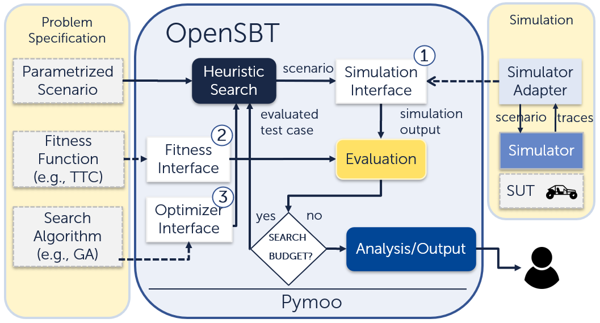

.. OpenSBT documentation master file, created by
   sphinx-quickstart on Sat Nov  2 01:54:34 2024.
   You can adapt this file completely to your liking, but it should at least
   contain the root `toctree` directive.

Welcome to OpenSBT's documentation! (Version: |version|)
===================================

.. toctree::
   :maxdepth: 3
   :caption: Contents

About
==================
OpenSBT is a modular and extensible codebase designed to facilitate search-based testing of 
automated driving systems, whether for research, in education or in an industrial context. 
An introductory video of OpenSBT can be found here: https://www.youtube.com/watch?v=qi_CTTzrk5s.
 

Getting Started
===============

This section will help you get started with installing and running **OpenSBT**.

Installation
+++++++++++++++

OpenSBT requires Python to be installed and its compatibility has been tested with Python 3.8. OpenSBT can be run as a standalone application or can be imported as a library.

A. Install the project as a dependency via pip:

.. code:: console

    $ pip install opensbt

    
B. Install the project as a standalone application:

First clone the project:

.. code:: console

    $ git clone https://github.com/opensbt/opensbt-core.git

Than install the dependencies:

.. code:: console

    $ pip install -r requirements.txt

A complete installation example is available as a `jupyter notebook <https://github.com/Leviathan321/leviathan321.github.io/blob/34-docs/docs/jupyter/01_Installation.ipynb>`_.  

Example
+++++++++++++++

In the core implementation of OpenSBT a simplified dummy simulator is integrated (linear motion planning, no GPU required). 

A testing problem for the dummy simulator can be e.g., defined and executed as follows:

.. code:: python

   # imports not shown
   problem = ADASProblem(
                        problem_name="DummySimulatorProblem",
                        scenario_path="scenarios/dummy_scenario.xosc",
                        simulation_variables=[
                           "orientation_ego",
                           "velocity_ego",
                           "orientation_ped",
                           "velocity_ped"],
                        xl=[0, 1, 0, 0.2],
                        xu=[180, 10,180, 3],
                        fitness_function=FitnessMinDistanceVelocity(),
                        critical_function=CriticalAdasDistanceVelocity(),
                        simulate_function=DummySimulator.simulate,
                        simulation_time=10,
                        sampling_time=0.25
                        )

   # Set search configuration
   config = DefaultSearchConfiguration()
   config.n_generations = 50
   config.population_size = 20

   # Instantiate search algorithm
   optimizer = NsgaIIOptimizer(
                              problem=problem,
                              config= config)

   # Run search
   res = optimizer.run()

   # Write results
   res.write_results(params = optimizer.parameters)

The experiment can be registed in OpenSBT via:

.. code:: python

   # imports not shown
   experiment = Experiment(name="5",
                           problem=problem,
                           algorithm=AlgorithmType.NSGAII,
                           search_configuration=DefaultSearchConfiguration())

   experiments_store.register(experiment)

To run an example test generation for this example run (flag -e holds the experiment number):

.. code:: console

   $ python run.py -e 5

Several result artefacts are generated after the generation has finished. All artefacts are written into the results folder in a folder named DummySimulator (problem name).

You can find also several other tutorials as jupyter notebooks which explain step-by-step of how integrate custom simulators and define testing components and objectives in OpenSBT.

The tutorials include as an example the integration of a real-world FMI-based AEB agent developed in the fortiss Mobility lab simulated in CARLA using the simulator adapter CARLA Runner Extension.

As another `example <https://git.fortiss.org/opensbt/prescan_runner>`_ we have integrated Simulink-based systems simulated in the Prescan simulator into OpenSBT.

APIs/Modules
===================================

You can find an overview of implemented modules, classes and functions here: :ref:`opensbt-modules`.

Tutorials
===============

You can find several tutorials that help you to apply OpenSBT for your testing tasks.

- `Esmini Testing Example (DeepTest '23) <https://git.fortiss.org/public-ast/opensbt-deeptest-tutorial>`_ - This tutorial explains how to model the testing problem as a search-based testing problem and integrate the esmini simulator to perform testing of an automated lanekeeping system.

- `Getting Started Tutorials <https://git.fortiss.org/opensbt/opensbt-core/-/tree/main/docs/jupyter?ref_type=heads>`_  - These tutorials explain the installation of OpenSBT, the execution of test runs, and the integration of a simulator into OpenSBT.

Architecture 
===============

OpenSBT builds upon Pymoo 0.6.0.1 and extends pymoos optimization related models to tailor heuristic search algorithms for testing automated driving systems.
An overview of the architecture is shown below:

Output
======

OpenSBT produces several result artefacts. An excerpt is given below.

**Design Space Plot**  
Visualization of all evaluated test cases in the input space and predicted failing regions using the decision tree algorithm, displayed pairwise. Constraints of derived regions are stored in a CSV file: :download:`bounds_regions.csv <https://git.fortiss.org/opensbt/opensbt-core/-/tree/main/docs/example/results/single/PedestrianCrossingStartWalk/NSGA2-F/ex1/classification/bounds_regions.csv>`. The learned tree is saved in :download:`tree.pdf <https://git.fortiss.org/opensbt/opensbt-core/-/tree/main/docs/example/results/single/PedestrianCrossingStartWalk/NSGA2-F/ex1/classification/tree.pdf>`.  

.. image:: https://github.com/ast-fortiss-tum/opensbt-core/blob/main/docs/example/results/single/PedestrianCrossingStartWalk/NSGA2-F/ex1/design_space/orientation_ego_orientation_ped.png?raw=True
   :alt: Design Space Plot
   :width: 400

**Scenario 2D Visualization**  
Visualization of traces of the ego vehicle and adversaries in a two-dimensional GIF animation.  

.. image:: https://github.com/ast-fortiss-tum/opensbt-core/blob/main/docs/example/results/single/PedestrianCrossingStartWalk/NSGA2-F/ex1/gif/0_trajectory.gif?raw=True
   :alt: Scenario Visualization
   :width: 300

**Objective Space Plot**  
Visualization of fitness values of evaluated test cases, displayed pairwise.  

.. image:: https://github.com/ast-fortiss-tum/opensbt-core/blob/main/docs/example/results/single/PedestrianCrossingStartWalk/NSGA2-F/ex1/objective_space/Min%20Adapted%20Distance_Velocity%20At%20Min%20Adapted%20Distance.png?raw=True
   :alt: Objective Space Plot
   :width: 400

**All Testcases**  
CSV file of all test inputs of all evaluated test cases: :download:`all_testcases.csv <https://git.fortiss.org/opensbt/opensbt-core/-/tree/main/docs/example/results/single/PedestrianCrossingStartWalk/NSGA2-F/ex1/all_testcases.csv>`

**All Failing Testcases**  
CSV file of all failing test inputs of all evaluated test cases: :download:`all_critical_testcases.csv <https://git.fortiss.org/opensbt/opensbt-core/-/tree/main/docs/example/results/single/PedestrianCrossingStartWalk/NSGA2-F/ex1/all_critical_testcases.csv>`

**Calculation Properties**  
CSV file containing experiment configuration parameters (e.g., algorithm parameters, such as population size, number of iterations, search space, fitness function, etc.): :download:`calculation_properties.csv <https://git.fortiss.org/opensbt/opensbt-core/-/tree/main/docs/example/results/single/PedestrianCrossingStartWalk/NSGA2-F/ex1/calculation_properties.csv>`

**Evaluation Results**  
CSV file with performance values of the algorithm, including the number of failing test cases found relative to all evaluations, and execution time: :download:`summary_results.csv <https://git.fortiss.org/opensbt/opensbt-core/-/tree/main/docs/example/results/single/PedestrianCrossingStartWalk/NSGA2-F/ex1/summary_results.csv>`

OpenSBTs Ecosystem
===============

- `OpenSBT-Core <https://git.fortiss.org/opensbt/opensbt-core>`_: Contains the OpenSBT framework and usage tutorials.
- `CARLA Runner <https://git.fortiss.org/opensbt/carla-runner>`_: Contains a simulation adapter to integrate the CARLA Simulator to simulate CARLA Agents and FMI-based SUTs with OpenSBT.
- `Prescan Runner <https://git.fortiss.org/opensbt/prescan_runner>`_: Contains a simulation adapter to integrate a Simulink-based SUT with OpenSBT to simulate it in the Prescan Simulator.
- `SUT Example <https://git.fortiss.org/opensbt/sut-examples>`_: Contains FMI-based SUT for the CARLA tutorial example in the Jupyter notebooks.
.. - opensbt-prescan-runner
.. - opensbt-carla-runner
.. - opensbt-ui
.. - opensbt-analysis

Releases
===============

- `0.1.6 <https://github.com/ast-fortiss-tum/opensbt-core/releases/tag/0.1.6>`_

Integrated Simulators
=====================

The following simulators have been integrated into OpenSBT:

- `Prescan <https://plm.sw.siemens.com/de-DE/simcenter/autonomous-vehicle-solutions/prescan/?srsltid=AfmBOopocBsnRiNvzArkpWzeY4hpyFAta4txtL_dYqWWtkw4w5u3PzhE>`_: `Example <https://git.fortiss.org/opensbt/prescan_runner>`_
- `CARLA <https://carla.org/>`_: `Example <https://git.fortiss.org/opensbt/carla-runner>`_
- `Donkey <https://github.com/tawnkramer/donkey>`_: `Example <https://git.fortiss.org/opensbt/opensbt-core/-/tree/main/examples/lanekeeping/donkey?ref_type=heads>`_
- `Udacity <https://github.com/udacity/self-driving-car-sim>`_: `Example <https://git.fortiss.org/opensbt/opensbt-core/-/tree/main/examples/lanekeeping/udacity?ref_type=heads>`_
- `BeamNG <https://www.beamng.com/game/>`_: `Example <your-example-link-here>`_
- `esmini <https://github.com/esmini/esmini>`_: `Example <https://git.fortiss.org/opensbt/opensbt-core/-/tree/main/examples/esmini?ref_type=heads>`_

Research Papers 
==================

OpenSBT has been used in multiple research projects:

- Replication Study: `Paper <https://dl.acm.org/doi/10.1016/j.infsof.2023.107286>`_, `Code <https://github.com/Leviathan321/reflection_study>`_
- Autonomous Driving Testing: `Paper <https://doi.org/10/10.1007/978-3-031-46002-9_15>`_, `Video <https://drive.google.com/file/d/1lr5BZpLFaxotwNFju43WF1C9fUTNM-SS/view?usp=sharing>`_
- Algorithm Benchmarking: `Paper <https://dl.acm.org/doi/10.1145/3643786.3648023>`_, `Code <https://github.com/ast-fortiss-tum/svm-paper-deeptest-24>`_
- Failure Coverage Study: `Paper <https://arxiv.org/html/2410.11769v1>`_, `Code <https://github.com/ast-fortiss-tum/coverage-emse-24>`_

Reference
==================

If you use or extend OpenSBT, please cite our framework. Here is an example BibTeX entry:

.. code-block:: bibtex

    @inproceedings{10.1145/3639478.3640027,
        author = {Sorokin, Lev and Munaro, Tiziano and Safin, Damir and Liao, Brian Hsuan-Cheng and Molin, Adam},
        title = {OpenSBT: A Modular Framework for Search-based Testing of Automated Driving Systems},
        year = {2024},
        isbn = {9798400705021},
        publisher = {Association for Computing Machinery},
        address = {New York, NY, USA},
        url = {https://doi.org/10.1145/3639478.3640027},
        doi = {10.1145/3639478.3640027},
        booktitle = {Proceedings of the 2024 IEEE/ACM 46th International Conference on Software Engineering: Companion Proceedings},
        pages = {94–98},
        numpages = {5},
        keywords = {search-based software testing, metaheuristics, scenario-based testing, autonomous driving, automated driving},
        location = {Lisbon, Portugal},
        series = {ICSE-Companion '24}
   }
License
==================

OpenSBT is licensed under the `Apache License, Version 2.0 <LICENSE>`_

Contribution
==================

If you like to contribute please contact one of the developers listed below or create a pull request. If you face any issues with OpenSBT feel free to create an issue or contact the developers.

Acknowledgements
==================

OpenSBT has been developed by `Lev Sorokin <mailto:lev.sorokin@tum.de>`_, 
`Tiziano Munaro <mailto:munaro@fortiss.org>`_, and `Damir Safin <mailto:safin@fortiss.org>`_ within the 
`FOCETA Project <https://www.foceta-project.eu/tools/>`_. 

Special thanks go to `Brian Hsuan-Cheng Liao <mailto:h.liao@eu.denso.com>`_ and Adam Molin from `DENSO AUTOMOTIVE Deutschland GmbH <https://www.denso.com/de/de/about-us/company-information/dnde/>`_ for their valuable feedback and evaluation of OpenSBT on the AVP Case Study in the Prescan simulator.

Support
==================

Lev Sorokin - lev.sorokin@tum.de